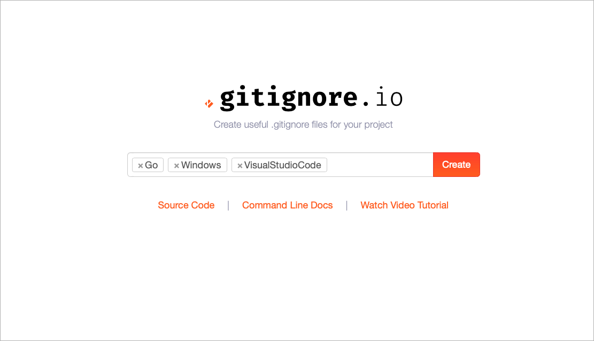

# Mastering Gitignore

- [x] ตัวอย่าง
- [x] patterns
- [x] ปัญหาที่พบบ่อย
- [ ] อธิบายจากตัวอย่าง

เบื้องต้นให้เข้าไปดูที่ https://github.com/github/gitignore ว่า ภาษาที่เราเขียน , IDE และ OS ที่เรากำลังใช้ เราควรต้อง ignore ไฟล์อะไรบ้าง

### ตัวอย่าง Windows
```
# Windows thumbnail cache files
Thumbs.db
Thumbs.db:encryptable
ehthumbs.db
ehthumbs_vista.db

# Dump file
*.stackdump

# Folder config file
[Dd]esktop.ini

# Recycle Bin used on file shares
$RECYCLE.BIN/

# Windows Installer files
*.cab
*.msi
*.msix
*.msm
*.msp

# Windows shortcuts
*.lnk
```

### ตัวอย่าง VS Code
```
.vscode/*
!.vscode/settings.json
!.vscode/tasks.json
!.vscode/launch.json
!.vscode/extensions.json
*.code-workspace
```

### ตัวอย่าง Go
```
# Binaries for programs and plugins
*.exe
*.exe~
*.dll
*.so
*.dylib

# Test binary, built with `go test -c`
*.test

# Output of the go coverage tool, specifically when used with LiteIDE
*.out

# Dependency directories (remove the comment below to include it)
# vendor/
```

### เว็บ gitignore.io
หรือเราจะใช้เว็บ http://gitignore.io ช่วย generate ไฟล์ .gitignore ก็ได้



ซึ่งจะได้ gitignore มาให้เราใช้ ดังนี้
```

# Created by https://www.gitignore.io/api/go,windows,visualstudiocode
# Edit at https://www.gitignore.io/?templates=go,windows,visualstudiocode

### Go ###
# Binaries for programs and plugins
*.exe
*.exe~
*.dll
*.so
*.dylib

# Test binary, built with `go test -c`
*.test

# Output of the go coverage tool, specifically when used with LiteIDE
*.out

# Dependency directories (remove the comment below to include it)
# vendor/

### Go Patch ###
/vendor/
/Godeps/

### VisualStudioCode ###
.vscode/*
!.vscode/settings.json
!.vscode/tasks.json
!.vscode/launch.json
!.vscode/extensions.json

### VisualStudioCode Patch ###
# Ignore all local history of files
.history

### Windows ###
# Windows thumbnail cache files
Thumbs.db
Thumbs.db:encryptable
ehthumbs.db
ehthumbs_vista.db

# Dump file
*.stackdump

# Folder config file
[Dd]esktop.ini

# Recycle Bin used on file shares
$RECYCLE.BIN/

# Windows Installer files
*.cab
*.msi
*.msix
*.msm
*.msp

# Windows shortcuts
*.lnk

# End of https://www.gitignore.io/api/go,windows,visualstudiocode
```

## Pattern สำหรับเขียน gitignore ด้วยตนเอง
* บรรทัดว่างไม่มีความหมายอะไร ใช้เพื่อให้อ่านง่ายขึ้น
* เริ่มต้นบรรทัดด้วย `#` คือ การ comment 
```
# this is a line of comment
```
* `!` ใช้เพื่อเป็นข้อยกเว้น ไมื่อไม่ต้องการ ignore บางอย่าง
* `\` ใช้ขึ้นต้นแต่ละบรรทัดนำหน้า `#` หรือ `!` เมื่อใช้ `#` และ `!` เป็น pattern ในการ ignore
* `/` ใช้เป็น **Directory Seperator**, โดยสามารถอยู่ได้ทั้ง ขึ้นต้น, กลาง และสิ้นสุด pattern
  * `doc/flotz` flotz เป็นได้ทั้ง directory และ file
  * `doc/flotz/` flotz เป็น directory
* `*` ใช้ match กับทุกอย่าง **ยกเว้น** `/`
* `?` ใช้ match กับ 1 อักขระ **ยกเว้น** `/`
* `[a-zA-Z]` ใช้ match กับ 1 อักขระ ที่อยู่ในช่วงที่กำหนด
* `**/` match กับทุก directory เช่น `**/foo` จะ match กับ "`foo`" ที่อยู่ในทุก directory
* `/**` match กับทุกอย่าง เช่น `foo/**` จะ match กับทุกอย่างที่อยู่ใน "`foo`" ไม่ว่าจะอยู่ลึกระดับใด
* `a/**/b` จะ match กับ "`a/b`", "`a/x/b`" หรือ "`a/x/y/b`"

อ่านเพิ่มเติม[ที่นี่](https://git-scm.com/docs/gitignore)


# แก้ปัญหาที่ไม่สามารถ ignore ไฟล์ที่เคยถูก commit แล้วได้
หลังจากเพิ่มไฟล์ .gitignore แล้ว ให้ใข้คำสั่งนี้
```bash
git rm -r --cached .
```

แล้วจึง add files ทั้งหมดอีกครั้ง
```bash
git add .
```

แล้ว commit
```bash 
git commit -m "applied .gitignore"
```
